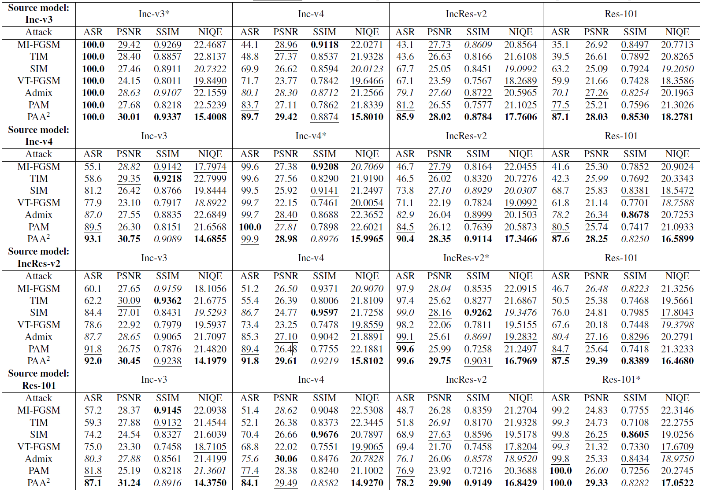
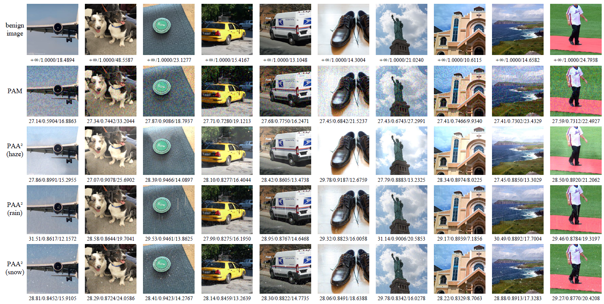

# PAA-2
code for paper You can’t handle the weather: Progressive amplified adverse-weather-gradient projection adversarial attack (PAA^2)


DNNs excel in vision tasks but are vulnerable to adversarial attacks and adverse weather effects, like haze, rain, and snow, posing security risks and impacting applications such as autonomous driving.

## Installation

```python
git clone https://github.com/awhitewhale/PAA-2.git
cd PAA-2
pip install -r requirements.txt
```
requirements.txt may contain lower versions of Python modules that have already been removed from the PyPI library, but higher versions should also work.

The experiments in this article are based on 

Linux node122 3.10.0-1160.92.1.el7.x86_64 #1 SMP Tue Jun 20 11:48:01 UTC 2023 x86_64 x86_64 x86_64 GNU/Linux,

Intel(R) Xeon(R) Gold 6230 CPU @ 2.10GHz,

NVIDIA Corporation GV100GL [Tesla V100 SXM2 32GB],

NVIDIA-SMI 510.47.03    Driver Version: 510.47.03    CUDA Version: 11.6,

GCC (GNU Compiler Collection) 11.2.1 20220127 (Red Hat 11.2.1-9).

## How to use

```python
python paa2.py -input_csv dataset.csv -input_dir dataset -max_epsilon 16.0 -num_iter_set 10 -batch_size 100 -momentum 1.0 -amplification 10.0 -prob 0.7
```


ASR (%), PSNR (dB), SSIM, and NIQE values of various gradient-based attacks in a single normally trained model environment. Adversarial examples
are generated using MI-FGSM, TIM, SIM, VT-FGSM, Admix, and PAM, and our PAA^2 attack methods on Inc-v3, Inc-v4, IncRes-v2,
and Res-101 models. * denotes white-box model. Bolded, Underlined, and Italicized represent the first, second, and third ranked performance, respectively.




Visualization of PAA^2 and PAM for adversarial examples. Here, we randomly selected ten images and generated adversarial examples on Inc-v3. The
variables in parentheses represent the noise types of PAA^2.



The user study webpage is available at https://github.com/awhitewhale/PAA-2/blob/main/html/userstudy.html.